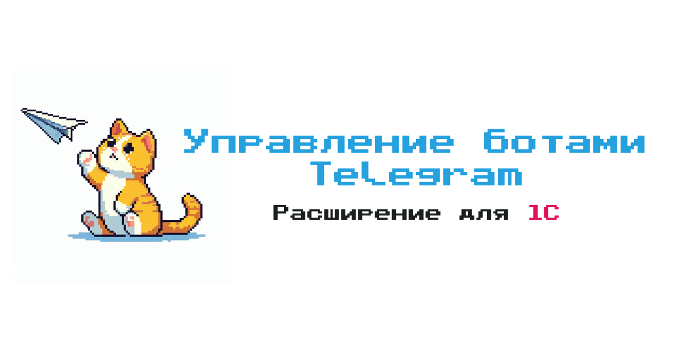

# "Управление ботами Telegram" - расширение для 1С

Расширение для конфигураций 1С на базе БСП (ERP, КА, УТ и другие), которое позволяет сократить время на настройку и конструирование ботов Telegram.

- Готовые объекты метаданных для первичной настройки и подключения ботов
- Взаимодействие с ботами через вебхуки или регламентные задания
- Установка списка доступных команд бота, включая персонализированный набор команд для отдельных чатов
- Простые сценарии отправки отчетов в чат в виде файла
- Интерфейс для написания произвольных сценариев на языке 1С
- Построение сложных цепочек общения с пользователем
- Исполнение сценариев по расписанию регламентным заданием
- Защита команд Telegram от несанкционированного использования

# Документация

В работе 🚧

# Поддержка

В разделе [Issues](https://github.com/KamranV21/1c-telegram-bot-management/issues) вы можете сообщить об обнаруженных ошибках или же оставить свое предложение по развитию расширения.

👉 [Сообщить об ошибке](https://github.com/KamranV21/1c-telegram-bot-management/issues/new?template=отчет-об-ошибке.md)

👉 [Предложить идею](https://github.com/KamranV21/1c-telegram-bot-management/issues/new?template=предложение.md)

# Статьи

[Управляем ботами Telegram из 1С - рассылка отчетов, пошаговое общение с чатами и произвольные скрипты](https://infostart.ru/1c/articles/2340171/)
