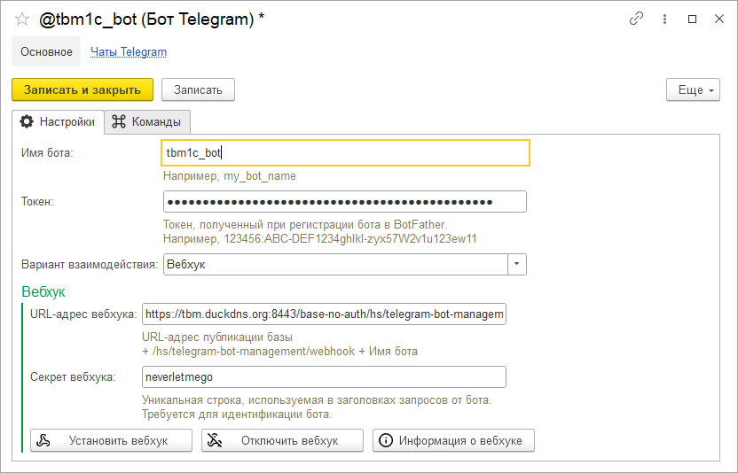

# Настройка бота

Для начала работы нам понадобится, собственно, сам бот в Telegram. Если бота у вас еще нет, то создать его можно буквально в несколько кликов с помощью BotFather: начинаем чат с BotFather, вводим команду /newbot, придумываем для нашего бота наименование и идентификатор, и вуаля. Теперь у вас есть свой бот в Telegram. Сразу после создания бота вы получите его уникальный токен авторизации, который должен выглядеть примерно так: 123456:ABC-DEF1234ghIkl-zyx57W2v1u123ew11

Теперь мы можем переключиться в 1С и продолжить настройку нашего бота там. После подключения расширения к вашей конфигурации в разделе "НСИ и администрирование" у вас появится новая подсистема "Управление ботами Telegram", где будет расположена ссылка на справочник "Боты Telegram". Создадим новый экземпляр справочника.

На вкладке "Настройки" укажем наименование бота и тот самый токен, что мы получили при создании бота.

Далее нужно будет определиться с вариантом взаимодействия между 1С и ботом Telegram - регламентное задание или с вебхук.

Если выбрать вариант с регламентным заданием, то для бота будет создано отдельное регламентное задание, которое по заданному расписанию будет обращаться к серверу Telegram, забирать оттуда все полученные ботом новые сообщения, после чего обрабатывать каждое из них в отдельности и отправлять ответы. Естественно, если мы хотим, чтобы отклик от бота на каждое введеное пользователем сообщение был бы быстрым, то расписание регламентного задания придется выставить с довольно высокой периодичностью.

Если для вас это проблема, то, конечно, лучше будет воспользоваться вариантом взаимодействия через вебхук, однако он потребует от вас некоторых дополнительных усилий, таких как публикация базы без авторизации, установка сертификата SSL и доменного имени. Подробнее узнать о том, как это все сделать, можно в замечательной статье от пользователя solidsun. В скобочках только замечу, что приведенный в статье вариант с бесплатными доменами от my.freenom.com более неактуален, вместо него могу посоветовать субдомены от duckdns. Кроме того, создавать HTTP-сервис, как это указано в статье, вам тоже не нужно - встроенный HTTP-сервис уже имеется в расширении.

Далее в форме настройки бота можно будет ввести полный URL-адрес вебхука, который будет выглядеть следующим образом:

Адрес публикации базы + /hs/telegram-bot-management/webhook/ + Имя бота

Например, https://mydomain.ru/1c-basename/hs/telegram-bot-management/webhook/my_bot_name

Дополнительно можно ввести секретный заголовок для вебхука, чтобы удостовериться, что запросы к HTTP-сервису действительно приходят от Telegram, а не из какого-нибудь стороннего сервиса.

Теперь можем нажать на кнопку "Установить вебхук", и если все было настроено правильно, то в 1С будет выведено оповещение об успешной установке вебхука. С помощью соответствующих кнопок на форме можно также отключить вебхук или получить информацию об уже подключенном к боту вебхуке.
