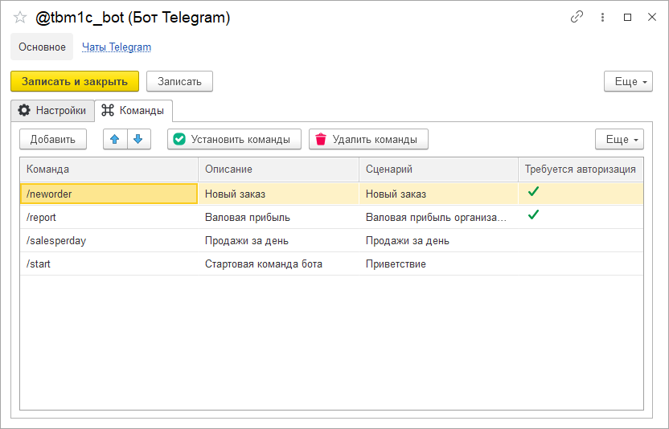

# Команды

Все взаимодействие между пользователем и ботом в Telegram осуществляется через команды. Задать список доступных команд бота можно на вкладке "Команды" формы справочника бота. Новую команду нужно добавить в соответствующую табличную часть на форме бота, присвоить ей имя, написанное на латинице по правилам Telegram, текстовое описание и сценарий. Для непосредственной установки команд или их очистки, т.е. для синхронизации с реальными командами бота в Telegram, можно воспользоваться соответствующими кнопками, расположенными над табличной частью.

