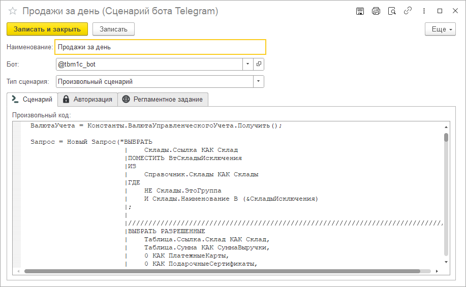

# Сценарии

Сценарий это отдельный справочник, внутри которого прописывается вся логика поведения бота при получении им от чата той иной команды. На текущий момент имеется возможность создать три типа сценариев: [Отправка отчета](docs\usage-guide\report-sending.md), [Общение](docs\usage-guide\conversation\conversation.md) и [Произвольный сценарий](docs\usage-guide\arbitrary-script\arbitrary-script.md).

Кроме того, здесь же можно настроить дополнительные свойства поведения, такие как [авторизация чатов](docs\usage-guide\chat-auth.md) или [регламентное задание исполнения](docs\usage-guide\scheduled-scripts.md).
