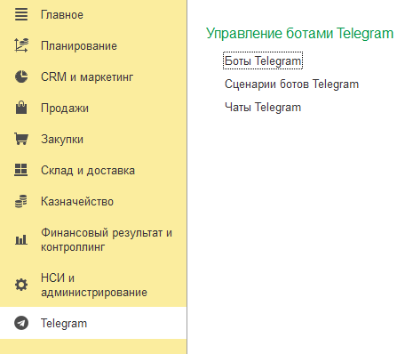

# Подсистема "Telegram"

После подключения расширения в вашей конфигурации появится новая подсистема "Telegram", в которой расположены основные объекты, необходимые для взаимодействия с мессенджером: [боты](docs\structure\bots.md), [чаты](docs\structure\chats.md) и [сценарии](docs\structure\scripts.md).

