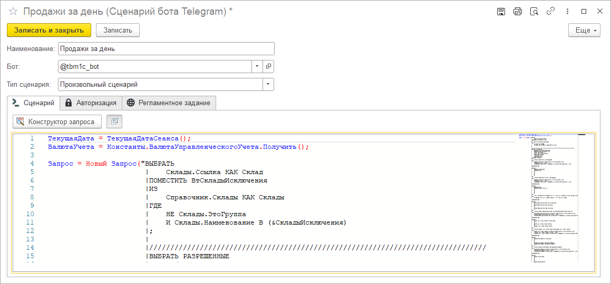

# Произвольный сценарий

Возможно, что вы хотите обработать полученную ботом команду неким особым образом. Это может быть что угодно. Например, вы хотите вернуть информацию о продажах за день в простом текстовом формате. Или, предположим, вы хотите вернуть сообщение с информацией об остатках средств на банковских счетах.

Реализовать абсолютно любую логику поведения бота можно с помощью сценария произвольного типа.

В текстовом поле, доступном при выборе данного типа сценария, вам нужно будет прописать ваш скрипт на встроенном языке платформы 1С. Выполнение кода происходит в безопасном режиме.

:::tip

Для удобства написания кода в режиме предприятия в форму сценария была добавлена консоль кода на основе Monaco Editor [Подробнее](https://github.com/salexdv/bsl_console).

:::
