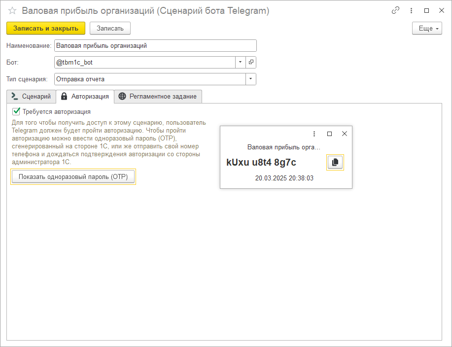
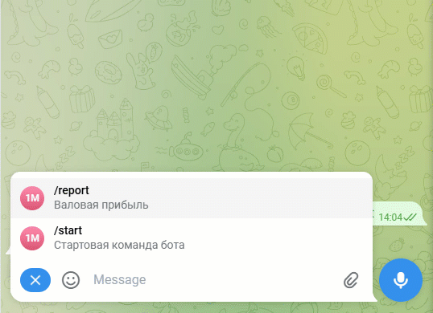
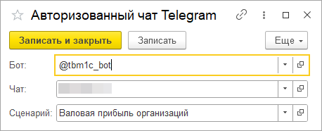

# Авторизация чатов

Вполне возможно, что какие-то из команд вашего бота будут предназначены для получения конфиденциальной информации, доступ к которой должен будет иметь только ограниченный круг лиц. Для того чтобы предотвратить несанкционированное использование команд бота вы можете включить у сценария признак "Требуется авторизация".

При включенном режиме обязательной авторизации пользователь должен будет получить право доступа на команду одним из двух способов: с помощью одноразового пароля или по номеру телефона

## Авторизация по одноразовому паролю (OTP)

Просмотреть одноразовый пароль можно нажав на соответствующую кнопку в панели "Авторизация" справочника сценариев. Пароли генерируются в разрезе сценариев, т.е. на каждую защищенную команду нужно будет получать новый пароль. Частота обновления пароля - 60 секунд.

## Авторизация по номеру телефона

При этом варианте авторизации необходимо отправить свою контактную информацию боту и дождаться подтверждения со стороны администратора 1С. Контактная информация пользователя в таком случае будет подвязана к вашему чату в 1С (каждый чат с ботом сохраняется в 1С в виде элемента справочника "Чаты ботов Telegram"). Администратор таким образом сможет идентифицировать чат по номеру телефона и задать ему доступ на защищенную команду в регистре сведений "Авторизованные чаты Telegram".

