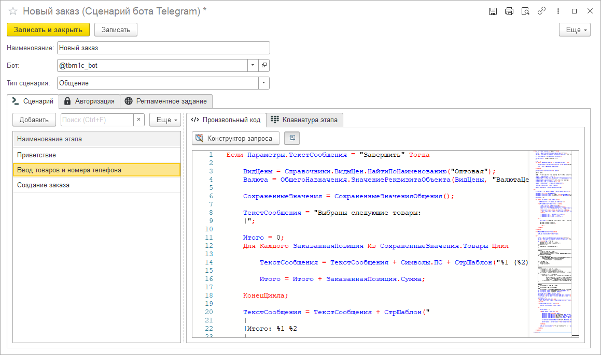

# Поэтапное общение

Порой простого одинарного исполнения скрипта при обработке команд ботом бывает недостаточно. Зачастую требуется построить более сложную логику взаимодействия с пользователем, которая выстраивается в целую цепочку действий типа запрос-ответ: пользователь отправляет команду, а бот в ответ просит пользователя выполнить определенное действие. Так продолжается до тех пор, пока цепочка не будет полностью завершена.

Реализация такого варианта взаимодействия доступна с помощью сценария с типом "Общение".

Так же, как и в случае и произвольным сценарием, от вас потребуется прописать всю логику исполнения команды на встроенном языке 1С, однако теперь вы сможете ввести сразу несколько таких скриптов, разбив их по этапам.

Помимо предопределенных переменных сценария, в общении вам так же доступны особые методы, с помощью которых вы можете запоминать и позже восстанавливать определенные значения, указывать кнопки клавиатуры, а также переходить от одного этапа к другому.
