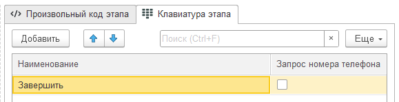

# Пример общения

## Постановка задачи

Рассмотрим пример построения сложного поэтапного общения между пользователем и ботом: мы создадим команду, с помощью которой можно можно будет оформлять заказы от клиентов. Весь процесс будет состоять из следующих действий:

1. Пользователь запускает команду создания заказа
2. В ответ бот приветствует пользователя и информирует его о том, что дальше от пользователя потребуется ввести в определенном формате артикулы и количество номенклатурных позиций, которые он планирует заказать.
3. Пользователь вводит артикулы и номенклатуры
4. Бот возвращает информацию о введенных товарах и добавляет их в корзину.
5. Пункт 4 может повторяться до тех пор, пока пользователь не нажмет на кнопку "Завершить"
6. После этого бот завершает подбор товаров и просит пользователя нажать на кнопку, чтобы отправить свой номер телефона
7. Пользователь нажимает на кнопку "Отправить свой номер телефона"
8. Бот создает заказ клиента и при необходимости нового контрагента, после чего сообщает пользователю номер заказа и его итоговую сумму.
9. Для того чтобы реализовать подобную логику мы создадим сценарий общения из трех этапов:

## Этап 1 - приветствие

<details>
<summary>Код первого этапа</summary>
```bsl
Результат.Сообщение.Текст = "Давайте оформим новый заказ.
|
|Введите список товаров, которые вы хотите заказать, в следующем формате:
|
|Артикул товара 1: Количество
|Артикул товара 2: Количество
|
|После окончания подбора товаров нажмите на кнопку ""Завершить""";

ЗавершитьЭтап(Параметры.НаименованиеТекущегоЭтапа);

````

</details>

## Этап 2 - ввод товаров и номера телефона

В данном этапе мы также укажем предопределенную кнопку клавиатуры "Завершить". Обратите внимание, что позже кнопки клавиатуры будут программным образом переиначены, чтобы вывести пользователю кнопку "Отправить свой номер телефона".



<details>
<summary>Код второго этапа</summary>
```bsl
Если Параметры.ТекстСообщения = "Завершить" Тогда

	ВидЦены = Справочники.ВидыЦен.НайтиПоНаименованию("Оптовая");
	Валюта = ОбщегоНазначения.ЗначениеРеквизитаОбъекта(ВидЦены, "ВалютаЦены");

	СохраненныеЗначения = СохраненныеЗначенияОбщения();

	ТекстСообщения = "Выбраны следующие товары:
	|";

	Итого = 0;
	Для Каждого ЗаказаннаяПозиция Из СохраненныеЗначения.Товары Цикл

		ТекстСообщения = ТекстСообщения + Символы.ПС + СтрШаблон("%1 (%2) - %3 шт. - %4 %5", ЗаказаннаяПозиция.Номенклатура, ЗаказаннаяПозиция.Артикул, ЗаказаннаяПозиция.Количество, ЗаказаннаяПозиция.Сумма, Валюта);

		Итого = Итого + ЗаказаннаяПозиция.Сумма;

	КонецЦикла;

	ТекстСообщения = ТекстСообщения + СтрШаблон("
	|
	|Итого: %1 %2
	|
	|Теперь отправьте нам свой номер телефона, по которому мы сможем с вами связаться.", Итого, Валюта);

	Параметры.КнопкиКлавиатуры.Очистить();
	КнопкаКлавиатуры = Справочники.УБТ_ОбщенияБотовTelegramСЧатами.НоваяСтруктураКнопкаКлавиатуры();

	КнопкаКлавиатуры.Наименование = "Отправить свой номер телефона";
	КнопкаКлавиатуры.ЗапросНомераТелефона = Истина;

	Параметры.КнопкиКлавиатуры.Добавить(КнопкаКлавиатуры);

	Результат.Сообщение.Текст = ТекстСообщения;

	ЗавершитьЭтап(Параметры.НаименованиеТекущегоЭтапа);

Иначе

	СтрокиТоваров = СтрРазделить(Параметры.ТекстСообщения, Символы.ПС);

	ТаблицаТоваров = Новый ТаблицаЗначений;
	ТаблицаТоваров.Колонки.Добавить("Артикул", Новый ОписаниеТипов("Строка", , , , Новый КвалификаторыСтроки(50)));
	ТаблицаТоваров.Колонки.Добавить("Количество", Новый ОписаниеТипов("Число", , , Новый КвалификаторыЧисла(15, 3)));

	ТекстОшибки = "";

	Для Каждого СтрокаТовара Из СтрокиТоваров Цикл

		АртикулИКоличество = СтрРазделить(СтрокаТовара, ":");

		Если АртикулИКоличество.Количество() = 2 Тогда

			Артикул = СокрЛП(АртикулИКоличество[0]);
			КоличествоСтрокой = СокрЛП(АртикулИКоличество[1]);
			Количество = СтроковыеФункцииКлиентСервер.СтрокаВЧисло(КоличествоСтрокой);

			Если Количество = Неопределено Или Количество <= 0 Тогда
				ТекстОшибки = ТекстОшибки + ?(ЗначениеЗаполнено(ТекстОшибки), Символы.ПС, "") + СтрШаблон("Укажите правильное количесто товара с артикулом %1", Артикул);
			КонецЕсли;

			СтрокаТаблицыТоваров = ТаблицаТоваров.Добавить();
			СтрокаТаблицыТоваров.Артикул = Артикул;
			СтрокаТаблицыТоваров.Количество = Количество;

		Иначе

			ТекстОшибки = "Пожалуйста, введите список товаров в следующем формате:
			|
			|Артикул товара 1: Количество
			|Артикул товара 2: Количество";

			Прервать;

		КонецЕсли;

	КонецЦикла;

	Если ЗначениеЗаполнено(ТекстОшибки) Тогда

		Результат.Сообщение.Текст = ТекстОшибки;

	Иначе

		ВидЦены = Справочники.ВидыЦен.НайтиПоНаименованию("Оптовая");
		Валюта = ОбщегоНазначения.ЗначениеРеквизитаОбъекта(ВидЦены, "ВалютаЦены");

		Запрос = Новый Запрос("ВЫБРАТЬ
		|	ТаблицаТоваров.Артикул КАК Артикул,
		|	ТаблицаТоваров.Количество КАК Количество
		|ПОМЕСТИТЬ ВтТовары
		|ИЗ
		|	&ТаблицаТоваров КАК ТаблицаТоваров
		|;
		|
		|////////////////////////////////////////////////////////////////////////////////
		|ВЫБРАТЬ
		|	ВтТовары.Артикул КАК Артикул,
		|	ВтТовары.Количество КАК Количество,
		|	МАКСИМУМ(ЕСТЬNULL(Номенклатура.Ссылка, ЗНАЧЕНИЕ(Справочник.Номенклатура.ПустаяСсылка))) КАК Номенклатура
		|ПОМЕСТИТЬ ВтНоменклатура
		|ИЗ
		|	ВтТовары КАК ВтТовары
		|		ЛЕВОЕ СОЕДИНЕНИЕ Справочник.Номенклатура КАК Номенклатура
		|		ПО ВтТовары.Артикул = Номенклатура.Артикул
		|			И (НЕ Номенклатура.ПометкаУдаления)
		|
		|СГРУППИРОВАТЬ ПО
		|	ВтТовары.Артикул,
		|	ВтТовары.Количество
		|;
		|
		|////////////////////////////////////////////////////////////////////////////////
		|ВЫБРАТЬ
		|	ВтНоменклатура.Артикул КАК Артикул,
		|	ВтНоменклатура.Количество КАК Количество,
		|	ВтНоменклатура.Номенклатура КАК Номенклатура,
		|	ЦеныНоменклатуры25СрезПоследних.Цена * ВтНоменклатура.Количество КАК Сумма
		|ИЗ
		|	ВтНоменклатура КАК ВтНоменклатура
		|		ВНУТРЕННЕЕ СОЕДИНЕНИЕ РегистрСведений.ЦеныНоменклатуры25.СрезПоследних(
		|				,
		|				ВидЦены = &ВидЦены И  ХарактеристикаЦО = ЗНАЧЕНИЕ(Справочник.ХарактеристикиНоменклатурыДляЦенообразования.ПустаяСсылка)
		|				И СерияЦО = ЗНАЧЕНИЕ(Справочник.СерииНоменклатурыДляЦенообразования.ПустаяСсылка)
		|				И УпаковкаЦО = ЗНАЧЕНИЕ(Справочник.УпаковкиЕдиницыИзмерения.ПустаяСсылка)) КАК ЦеныНоменклатуры25СрезПоследних
		|		ПО (ВтНоменклатура.Номенклатура = ЦеныНоменклатуры25СрезПоследних.Номенклатура)
		|;
		|
		|////////////////////////////////////////////////////////////////////////////////
		|ВЫБРАТЬ
		|	ВтНоменклатура.Артикул КАК Артикул
		|ИЗ
		|	ВтНоменклатура КАК ВтНоменклатура
		|ГДЕ
		|	ВтНоменклатура.Номенклатура = ЗНАЧЕНИЕ(Справочник.Номенклатура.ПустаяСсылка)");
		Запрос.УстановитьПараметр("ТаблицаТоваров", ТаблицаТоваров);
		Запрос.УстановитьПараметр("ВидЦены", ВидЦены);

		МассивРезультатов = Запрос.ВыполнитьПакет();
		ВыборкаТовары = МассивРезультатов[МассивРезультатов.Количество() - 2].Выбрать();
		ВыборкаОшибки = МассивРезультатов[МассивРезультатов.Количество() - 1].Выбрать();

		ТекстОшибки = "";
		Пока ВыборкаОшибки.Следующий() Цикл
			ТекстОшибки = ТекстОшибки + ?(ЗначениеЗаполнено(ТекстОшибки), Символы.ПС, "") + СтрШаблон("Не найден товар с артикулом %1, ВыборкаОшибки.Артикул)");
		КонецЦикла;

		Если ЗначениеЗаполнено(ТекстОшибки) Тогда

			Результат.Сообщение.Текст = ТекстОшибки;

		Иначе

			ТекстСообщения = "";

			Пока ВыборкаТовары.Следующий() Цикл

				ЗаказаннаяПозиция = Новый Структура;
				ЗаказаннаяПозиция.Вставить("Номенклатура", ВыборкаТовары.Номенклатура);
				ЗаказаннаяПозиция.Вставить("Артикул", ВыборкаТовары.Артикул);
				ЗаказаннаяПозиция.Вставить("Количество", ВыборкаТовары.Количество);
				ЗаказаннаяПозиция.Вставить("Сумма", ВыборкаТовары.Сумма);

				СохранитьЗначениеОбщенияВМассиве("Товары", ЗаказаннаяПозиция);

				ТекстСообщения = ТекстСообщения + ?(ЗначениеЗаполнено(ТекстСообщения), Символы.ПС, "") + СтрШаблон("%1 (%2) - %3 шт. - %4 %5", ВыборкаТовары.Номенклатура, ВыборкаТовары.Артикул,  ВыборкаТовары.Количество, ВыборкаТовары.Сумма, Валюта);

			КонецЦикла;

			Результат.Сообщение.Текст = "Выбраны следующие товары:" + Символы.ПС + ТекстСообщения;

		КонецЕсли;

	КонецЕсли;

КонецЕсли;
````

</details>

## Этап 3 - создание заказа

<details>
<summary>Код третьего этапа</summary>

```bsl
НаименованиеКонтрагента = Параметры.Контакт.Имя;
НомерТелефона = Параметры.Контакт.Имя;

ВидЦены = Справочники.ВидыЦен.НайтиПоНаименованию("Оптовая");
Валюта = ОбщегоНазначения.ЗначениеРеквизитаОбъекта(ВидЦены, "ВалютаЦены");

ЗаказКлиента = Документы.ЗаказКлиента.СоздатьДокумент();
ЗаказКлиента.Заполнить(Неопределено);
ЗаказКлиента.Дата = ТекущаяДатаСеанса();
ЗаказКлиента.Организация = Справочники.Организации.НайтиПоНаименованию("Торговый дом ""Комплексный""");
ЗаказКлиента.Валюта = Валюта;
ЗаказКлиента.ЦенаВключаетНДС = Истина;
ЗаказКлиента.НалогообложениеНДС = Перечисления.ТипыНалогообложенияНДС.ПродажаОблагаетсяНДС;

Запрос = Новый Запрос("ВЫБРАТЬ
|	КонтактнаяИнформация.Ссылка КАК Партнер
|ИЗ
|	Справочник.Партнеры.КонтактнаяИнформация КАК КонтактнаяИнформация
|ГДЕ
|	КонтактнаяИнформация.Представление = &НомерТелефона
|	И КонтактнаяИнформация.Тип = ЗНАЧЕНИЕ(Перечисление.ТипыКонтактнойИнформации.Телефон)");
Запрос.УстановитьПараметр("НомерТелефона", НомерТелефона);

Выборка = Запрос.Выполнить().Выбрать();

Если Выборка.Следующий() Тогда

	ЗаказКлиента.Партнер = Выборка.Партнер;
	ПартнерыИКонтрагенты.ЗаполнитьКонтрагентаПартнераПоУмолчанию(ЗаказКлиента.Партнер, ЗаказКлиента.Контрагент);

Иначе

	ПартнерОбъект = Справочники.Партнеры.СоздатьЭлемент();
	ПартнерОбъект.Наименование = НаименованиеКонтрагента;
	ПартнерОбъект.НаименованиеПолное = НаименованиеКонтрагента;
	ПартнерОбъект.ЮрФизЛицо = Перечисления.КомпанияЧастноеЛицо.ЧастноеЛицо;
	ПартнерОбъект.Клиент = Истина;
	ПартнерОбъект.Записать();

	ТелефонXML = УправлениеКонтактнойИнформацией.КонтактнаяИнформацияВXML(НомерТелефона, НомерТелефона, Перечисления.ТипыКонтактнойИнформации.Телефон);
	ТелефонJSON = УправлениеКонтактнойИнформацией.КонтактнаяИнформацияВJSON(ТелефонXML);
	УправлениеКонтактнойИнформацией.ДобавитьКонтактнуюИнформацию(ПартнерОбъект, ТелефонJSON, Справочники.ВидыКонтактнойИнформации.ТелефонПартнера, ТекущаяДатаСеанса(), Ложь);

	КонтрагентОбъект = Справочники.Контрагенты.СоздатьЭлемент();
	КонтрагентОбъект.Наименование = НаименованиеКонтрагента;
	КонтрагентОбъект.НаименованиеПолное = НаименованиеКонтрагента;
	КонтрагентОбъект.Партнер = ПартнерОбъект.Ссылка;
	КонтрагентОбъект.ЮрФизЛицо =  Перечисления.ЮрФизЛицо.ФизЛицо;
	КонтрагентОбъект.Записать();

	ЗаказКлиента.Партнер = ПартнерОбъект.Ссылка;
	ЗаказКлиента.Контрагент = КонтрагентОбъект.Ссылка;

КонецЕсли;

СохраненныеЗначения = СохраненныеЗначенияОбщения();

СтруктураДействий = Новый Структура;
СтруктураПересчетаСуммы = ОбработкаТабличнойЧастиКлиентСервер.ПараметрыПересчетаСуммыНДСВСтрокеТЧ(ЗаказКлиента);
СтруктураДействий.Вставить("ЗаполнитьСтавкуНДС", ОбработкаТабличнойЧастиКлиентСервер.ПараметрыЗаполненияСтавкиНДС(ЗаказКлиента, Истина));
СтруктураДействий.Вставить("ЗаполнитьЦенуПродажи", ОбработкаТабличнойЧастиКлиентСервер.ПараметрыЗаполненияЦеныВСтрокеТЧ(ЗаказКлиента));
СтруктураДействий.Вставить("ПересчитатьКоличествоЕдиниц");
СтруктураДействий.Вставить("ПересчитатьСуммуНДС", СтруктураПересчетаСуммы);
СтруктураДействий.Вставить("ПересчитатьСуммуСНДС", СтруктураПересчетаСуммы);
СтруктураДействий.Вставить("ПересчитатьСумму");
СтруктураДействий.Вставить("ПересчитатьСуммуСУчетомРучнойСкидки", Новый Структура("Очищать", Ложь));
СтруктураДействий.Вставить("ПересчитатьСуммуСУчетомАвтоматическойСкидки", Новый Структура("Очищать", Истина));
СтруктураДействий.Вставить("ПересчитатьСуммуСУчетомСкидкиБонуснымиБаллами");

Для Каждого ЗаказаннаяПозиция Из СохраненныеЗначения.Товары Цикл

	СтрокаТабличнойЧасти = ЗаказКлиента.Товары.Добавить();

	СтрокаТабличнойЧасти.Номенклатура = ЗаказаннаяПозиция.Номенклатура;
	СтрокаТабличнойЧасти.Количество = ЗаказаннаяПозиция.Количество;
	СтрокаТабличнойЧасти.КоличествоУпаковок = ЗаказаннаяПозиция.Количество;
	СтрокаТабличнойЧасти.ВидЦены = ВидЦены;

	ОбработкаТабличнойЧастиСервер.ОбработатьСтрокуТЧ(СтрокаТабличнойЧасти, СтруктураДействий, Неопределено);

	СтрокаТабличнойЧасти.ВариантОбеспечения = Перечисления.ВариантыОбеспечения.КОбеспечению;

КонецЦикла;

СтруктураПараметры = СкидкиНаценкиЗаполнениеСервер.НовыйПараметрыРассчитать();
СтруктураПараметры.ПрименятьКОбъекту = Ложь;
СтруктураПараметры.ТолькоПредварительныйРасчет = Ложь;
СтруктураПараметры.ВосстанавливатьУправляемыеСкидки = Истина;
СтруктураПараметры.УправляемыеСкидки = Неопределено;

СкидкиНаценкиЗаполнениеСервер.Рассчитать(ЗаказКлиента, СтруктураПараметры);
ЗаказКлиента.СкидкиРассчитаны = Истина;

ЗаказыСервер.УстановитьКлючВСтрокахТабличнойЧасти(ЗаказКлиента, "Товары");
ЗаказКлиента.СуммаДокумента = ЗаказКлиента.ПолучитьСуммуЗаказанныхСтрок();

ЗаказКлиента.Записать(РежимЗаписиДокумента.Проведение);

Результат.Сообщение.Текст = СтрШаблон("Ваш заказ принят!
|
|Номер заказа: %1
|Сумма: %2 %3
|
|Скоро с вами свяжется наш оператор для уточнения деталей.
|
|Спасибо!",
ЗаказКлиента.Номер, ЗаказКлиента.СуммаДокумента, ЗаказКлиента.Валюта);

ЗавершитьЭтап(Параметры.НаименованиеТекущегоЭтапа);
```

</details>

## Результат

Проверяем результат:


