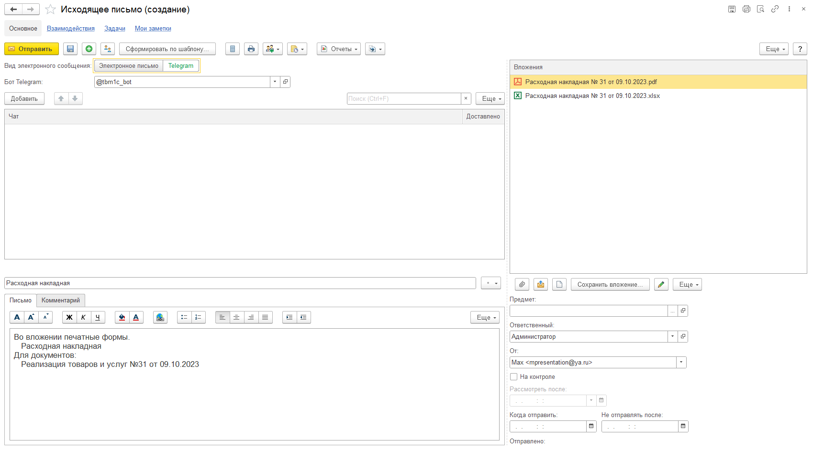
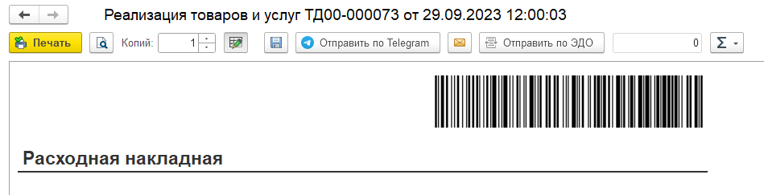
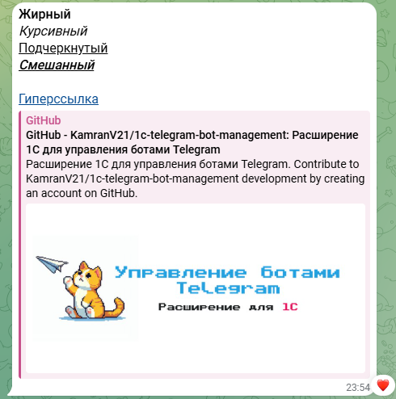

# Форма передачи сообщений

УБТ расширяет возможности документа БСП "Электронное письмо исходящее", позволяя использовать его не только для отправки электронных писем, но и для передачи сообщений в чаты Telegram.

## Электронное письмо исходящее

Для того чтобы переключить документ в режим Telegram-сообщения необходимо воспользоваться специальным переключателем, расположенным в шапке формы.

При использовании документа в режиме Telegram-сообщения от пользователя потребуется указать бота, от которого будет выполнена передача сообщений, а также список чатов-получателей.

При этом поддерживается функционал передачи вложений, а также формирование текста сообщений по шаблону.

## Печатные формы и отчеты

В типовые формы печати документов и отчетов добавлена отдельная кнопка для быстрого вызова формы электронного сообщения, в которое в качестве вложения автоматически будет добавлен сформированный табличный документ.

## Сообщения в формате HTML

Telegram поддерживает сообщения в формате HTML, но с ограниченным набором [доступных тегов](https://core.telegram.org/bots/api#html-style). По этой причине в момент передачи HTML-сообщений будет выполнена трансляция содержащихся в них тегов и стилей в понятный для Telegram формат. На текщий момент поддерживается передача жирного шрифта, курсива, подчеркивания, а также гиперссылок.

