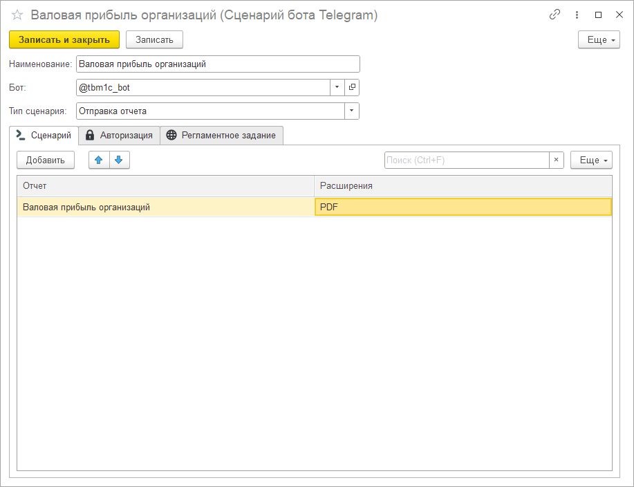
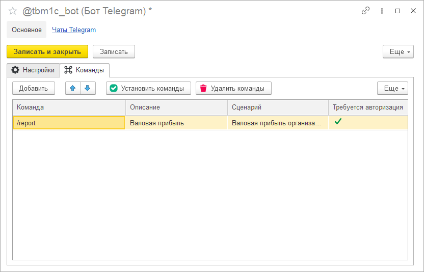
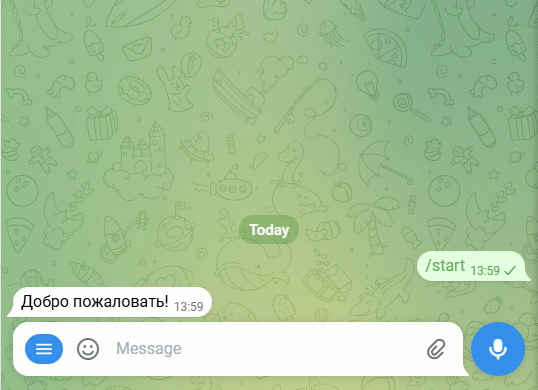

# Рассылка отчетов

Представим, что перед нами стоит следующая задача: при вызове пользователем определенной команды в Telegram, например /report, бот должен вернуть ответ в виде файла отчета, сформированного на стороне 1С.

Для решения этой задачи создадим новый сценарий с типом "Отправка отчета". На вкладке "Сценарий" в таком случае станет доступна табличная часть, в которой нужно будет указать вариант отчета, планируемый к отправке в качестве ответа, а также указать одно или несколько расширений файла.

Сохраняем сценарий, после чего в справочнике ботов на вкладке "Команды" добавляем новую команду /report, которой присваиваем сценарий отправки отчета. Дополнительно указываем краткое описание команды, которое будет отображаться у пользователей бота. Сохраняем изменения и далее нажимаем на кнопку "Установить команды", чтобы синхронизировать заданный список команд в 1С с реально доступными командами бота в Telegram.

Проверяем результат:

