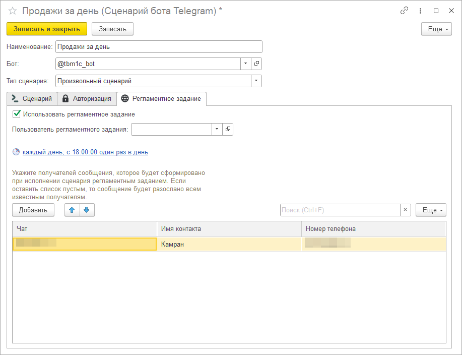

# Исполнение сценариев по расписанию

Каждый из сценариев может выполняться самостоятельно по заданному расписанию. Настроить расписание можно на вкладке "Регламентное задание". Задать список чатов-получателей сообщения можно в соответствующей табличной части. Если список чатов оставить пустым, то сообщение будет разослано во все известные боту чаты.

